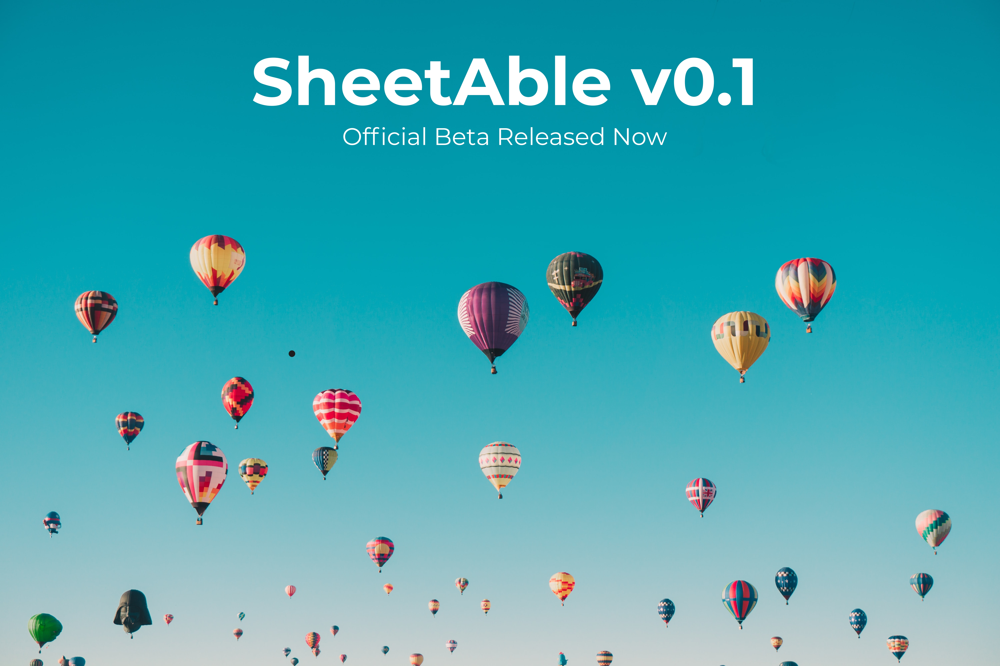

### SheetAble v0.1 has launched! 
If you want to start testing, head over to the [Installation guide](/docs) to get started. If you have any further questions check out the [FAQ](/docs/faq) or ask in our [Discord Server](http://localhost:3000/docs/faq).
 
Thank you for being part of the SheetAble Beta.

**Good luck testing and have a great day!**

